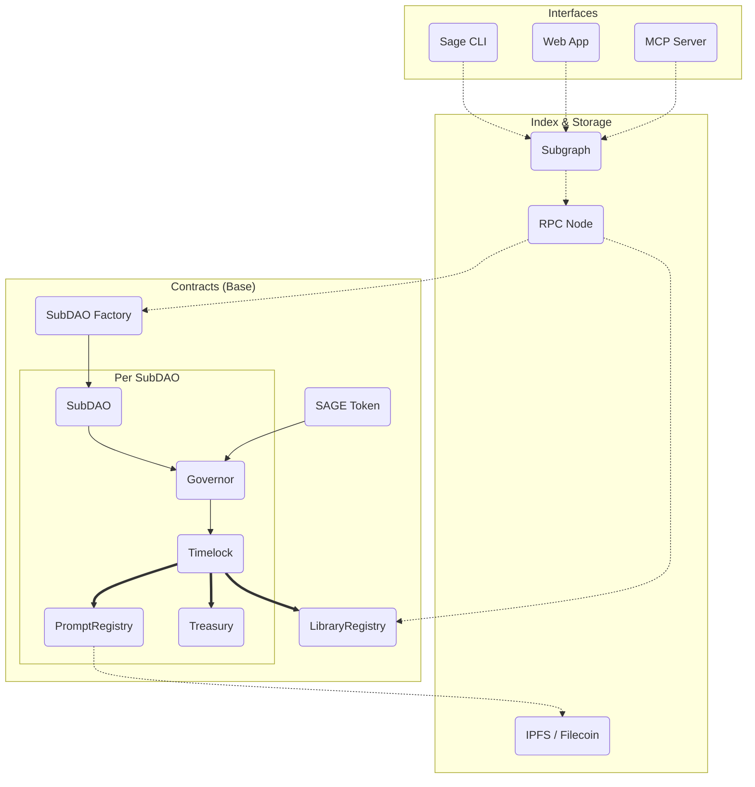

# Protocol Architecture

This document outlines the high-level architecture of the Sage Protocol smart contracts. The protocol is designed as a modular and extensible system for community-owned agent instructions.

## Core Components

The Sage protocol's architecture is composed of several core smart contracts and off-chain components that work together to provide a robust and secure system.

- **SubDAO Factory (`SubDAOFactoryOptimized.sol`)**: The main entry point for creating new SubDAOs using gas-efficient EIP-1167 minimal proxies. It sets up the initial configuration of a SubDAO, including its governance model, access control, and prompt registry.

- **SubDAO (`SubDAO.sol`)**: A self-governed entity that manages a collection of prompt libraries, with its own treasury, governance contract (`PromptGovernor`), and prompt registry (`PromptRegistry`).

- **Prompt Registry (`PromptRegistry.sol`)**: Stores and manages prompts, supporting versioning, forking, and attribution.

- **Prompt Governor (`PromptGovernor.sol`)**: The governance contract for a SubDAO, allowing members to vote on proposals using the `SXXX` token.

- **SXXX Token (`SXXX.sol`, `SXXXProper.sol`)**: The native governance token for staking, voting, and incentives.

- **Library Registry (`LibraryRegistry.sol`)**: A global, append-only directory for discovering library manifests across the protocol.

- **LaunchGate & Treasury System**: For production operations like launching Liquidity Bootstrapping Pools (LBPs) on Doppler, Sage uses a secure architecture centered around the `LaunchGate.sol` contract and a multisig-managed treasury (e.g., a Gnosis Safe). This system includes several key features for security and transparency:
    - **On-chain Spend Limits**: `TreasuryWrapper` uses ARBAC roles and selector allowlists to enforce on-chain spending limits.
    - **DAO Executor Role**: The DAO timelock has a `DAO_EXECUTOR_ROLE` to trigger `LaunchGate` actions directly, while the Safe retains admin powers.
    - **Custodial Wrapper**: `TreasuryWrapper` holds the funds (USDC/ETH) for launches, ensuring all spending is transparent and on-chain.
    - **Prepare-Only CLI Flow**: The `sage` CLI produces transaction payloads for the Safe to review and approve, which then target `TreasuryWrapper`.
    - **Registry-driven Configuration**: `LaunchGate` reads configuration from the protocol registry, which is controlled by the treasury admins.
    - **Auditable Events**: `TreasuryWrapper` and `LaunchGate` emit detailed events for a full audit trail.

- **Off-chain Components**:
    - **IPFS Worker**: A Cloudflare Worker for IPFS uploads, pinning, and managing ledgers for paid pinning and prompt commerce.
    - **MCP Server**: The Model Context Protocol server, providing a primary interface for agents to interact with the protocol.

## System Overview

