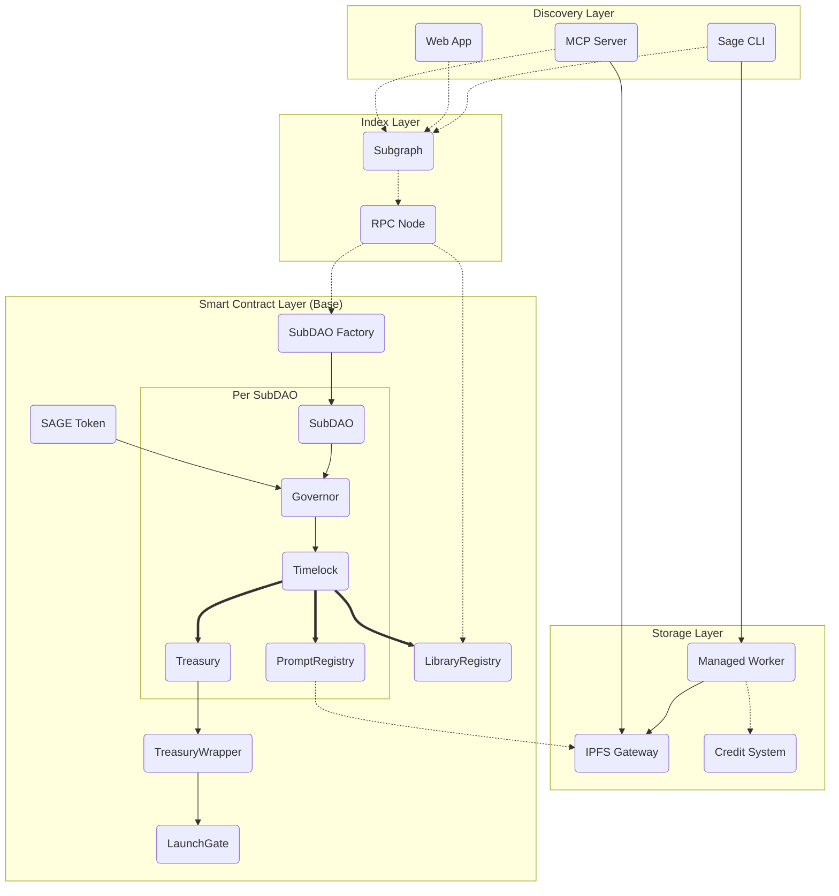

# Protocol Architecture

This document outlines the high-level architecture of the Sage Protocol smart contracts. The protocol is designed as a modular and extensible system for community-owned agent instructions.

## Core Components

The Sage protocol's architecture is composed of several core smart contracts and off-chain components that work together to provide a robust and secure system.

- **SubDAO Factory (`SubDAOFactoryOptimized.sol`)**: The main entry point for creating new SubDAOs using gas-efficient EIP-1167 minimal proxies. It sets up the initial configuration of a SubDAO, including its governance model, access control, and prompt registry.

- **SubDAO (`SubDAO.sol`)**: A self-governed entity that manages a collection of prompt libraries, with its own treasury, governance contract (`PromptGovernor`), and prompt registry (`PromptRegistry`).

- **Prompt Registry (`PromptRegistry.sol`)**: Stores and manages prompts, supporting versioning, forking, and attribution.

- **Prompt Governor (`PromptGovernor.sol`)**: The governance contract for a SubDAO, allowing members to vote on proposals using the `SXXX` token.

- **SXXX Token (`SXXX.sol`, `SXXXProper.sol`)**: The native governance token for staking, voting, and incentives.

- **Library Registry (`LibraryRegistry.sol`)**: A global, append-only directory for discovering library manifests across the protocol.

- **LaunchGate & Treasury System**: For production operations like launching Liquidity Bootstrapping Pools (LBPs) on Doppler, Sage uses a secure architecture centered around the `LaunchGate.sol` contract and a multisig-managed treasury (e.g., a Gnosis Safe). This system includes several key features for security and transparency:
    - **On-chain Spend Limits**: `TreasuryWrapper` uses ARBAC roles and selector allowlists to enforce on-chain spending limits.
    - **DAO Executor Role**: The DAO timelock has a `DAO_EXECUTOR_ROLE` to trigger `LaunchGate` actions directly, while the Safe retains admin powers.
    - **Custodial Wrapper**: `TreasuryWrapper` holds the funds (USDC/ETH) for launches, ensuring all spending is transparent and on-chain.
    - **Prepare-Only CLI Flow**: The `sage` CLI produces transaction payloads for the Safe to review and approve, which then target `TreasuryWrapper`.
    - **Registry-driven Configuration**: `LaunchGate` reads configuration from the protocol registry, which is controlled by the treasury admins.
    - **Auditable Events**: `TreasuryWrapper` and `LaunchGate` emit detailed events for a full audit trail.

- **Off-chain Components**:
    - **IPFS Worker**: A Cloudflare Worker for IPFS uploads, pinning, and managing ledgers for paid pinning and prompt commerce.
    - **MCP Server**: The Model Context Protocol server, providing a primary interface for agents to interact with the protocol.

## System Overview

The protocol architecture consists of three main layers working together to provide governed, content-addressed agent instructions:



---

## Storage Infrastructure

The storage layer ensures prompts and manifests are **permanently available**, **cryptographically verifiable**, and **economically sustainable**.

### IPFS Content Addressing

All prompt content is stored on IPFS (InterPlanetary File System):

- **Content Identifiers (CIDs)**: Each file has a unique hash (e.g., `bafybeigdyrzt5sfp7udm7hu76uh7y26nf3efuylqabf3oclgtqy55fbzdi`)
- **Immutability**: Changing a single byte produces a different CID
- **Deduplication**: Identical content only needs to be stored once
- **Decentralization**: Multiple nodes can pin and serve the same content

### Managed Worker (Cloudflare Worker)

A serverless Cloudflare Worker mediates uploads, pinning, and gateway warming:

**Key Functions:**

1. **Credit Checks**: Validates user has sufficient credits before accepting uploads
2. **Metadata Validation**: Ensures manifests conform to schema before pinning
3. **Gateway Warming**: Pre-caches content on multiple IPFS gateways for low-latency access
4. **Telemetry**: Tracks usage stats (downloads, bandwidth) for analytics
5. **Payment Processing**: Handles 402 Payment Required flows for credit purchases

**Endpoints:**

- `POST /upload` - Upload and pin content (requires credits)
- `GET /pin/:cid` - Re-pin existing content
- `POST /buy-credits` - Purchase pinning credits (USDC or SAGE)
- `GET /credits` - Check current credit balance
- `GET /telemetry` - View usage statistics

### Credit System (Two-Phase Model)

**Phase A (Current)**: Off-chain credits via Cloudflare Durable Objects

- Users purchase credits through the worker's 402 payment flow
- Credits are tracked in a persistent Durable Object ledger
- Worker debits credits per pin operation (cost: ~$0.01-0.10 per GB/month)
- CLI commands:
  ```bash
  sage ipfs credits  # Check balance
  sage ipfs buy-credits --amount 100 --currency USDC
  sage ipfs pin manifest.json  # Debits credits
  ```

**Phase B (Roadmap)**: On-chain `CreditToken` + `PaymentRouter`

- ERC-20 credit token (`CREDIT`) minted via bonding curve
- Smart contracts enforce burns per pin operation
- Transparent on-chain accounting of storage costs
- Automated treasury rebalancing based on usage

### Gateway Infrastructure

**Primary Gateway**: `https://gateway.sageprotocol.io`

- Cloudflare-backed for global CDN distribution
- 99.9% uptime SLA
- Automatic failover to public gateways

**Fallback Gateways**:

- `https://w3s.link/ipfs/`
- `https://ipfs.io/ipfs/`
- `https://cloudflare-ipfs.com/ipfs/`

**Warming Strategy**: When content is pinned, the worker pre-fetches it on multiple gateways to ensure low-latency first-read performance.

---
